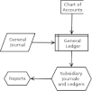

# Accounting System

A basic accounting system compliant with Generally Accepted Accounting Practice (or Principles) (GAAP). It is written in python 3.7 and SQLite3.

## Introduction  
  
There are lots of accounting information systems both proprietary and free and open source. I needed a project to exercise my python, sql and tkinter coding. The fact that it is a necessary review of my MBA curriculum doesn't hurt either after a long absence of my attention there. Finally, I think another open source offering is good and this is intened be a simple, straight forward, and transparent development offering of a accounting application. 

## Principle 
The central core of accounting is considered to be the General Ledger. The instrument of first entry however is the General Journal. All other aspects of the system are either suecondary entry or subsidieary journals and reoprts. The well known Balance Sheet, the consolidated picture of an enterprise, is a report based on tge General Ledger contents.

The entry of business activities is first into the Journal, or day book. The items of the Journal are posted then to the Ledger. The double entry technique of accounting ensures that the credit accounts and the debit accounts remain in balance. If the credits always equal the the debits from the outset, and there is no other confounding entries allowed balance is retained. This is a kind of drudge task for which computer programs is eminently suited.

## Approach
Thus the Journal is where data enters the system and is the date-time record of activity. Data is then reorganized and transferred to the Ledger. The ledger is the categorized permanent record of the enterprise's functioning - taking in revenue and paying expenses to produce some value. The business operation is accountable to internal and external stakeholders. This accounting to stakeholders requires a data trail is maintained with integrity and be demonstable on demand. The audit trailas it is called must be immutable right to the reports needed to account to stakeholders.

The underlying categorization is defined by a set of accounts to which activities are attributated. This is kept in the Chart of Accounts. In modern American GAAP there are five essential accounts aways present as prinary accounts with variable kinds of subsidiary accounts providing a detailed breakdown of these five. These in the US, Canada and the UK are 1) Assets Account, 2) Liabilities Account, 3) Equity or Capital Accounts, 4) Revenue or Income Account and 5) Expense of Costs Account. There is usually some way to remove bad data or expired value from the system. This sixth account or Disposables (6) is how depreciated value, bad debts and perhaps erroneous data, can be removed from the system in a clearly demonstrable and auditable way. 
  
DEBIT ACCOUNTS | NUMBERING | CREDIT ACCOUNTS 
---------------|-----------|-----------------
Assets         |   1xx     |
  |   2xx     | Liabilities
  |   3xx     | Equity
|   4xx     | Revenue
Expenses       |   5xx     |
|   6xx     | Depreciation
---------------|-----------|-----------------
